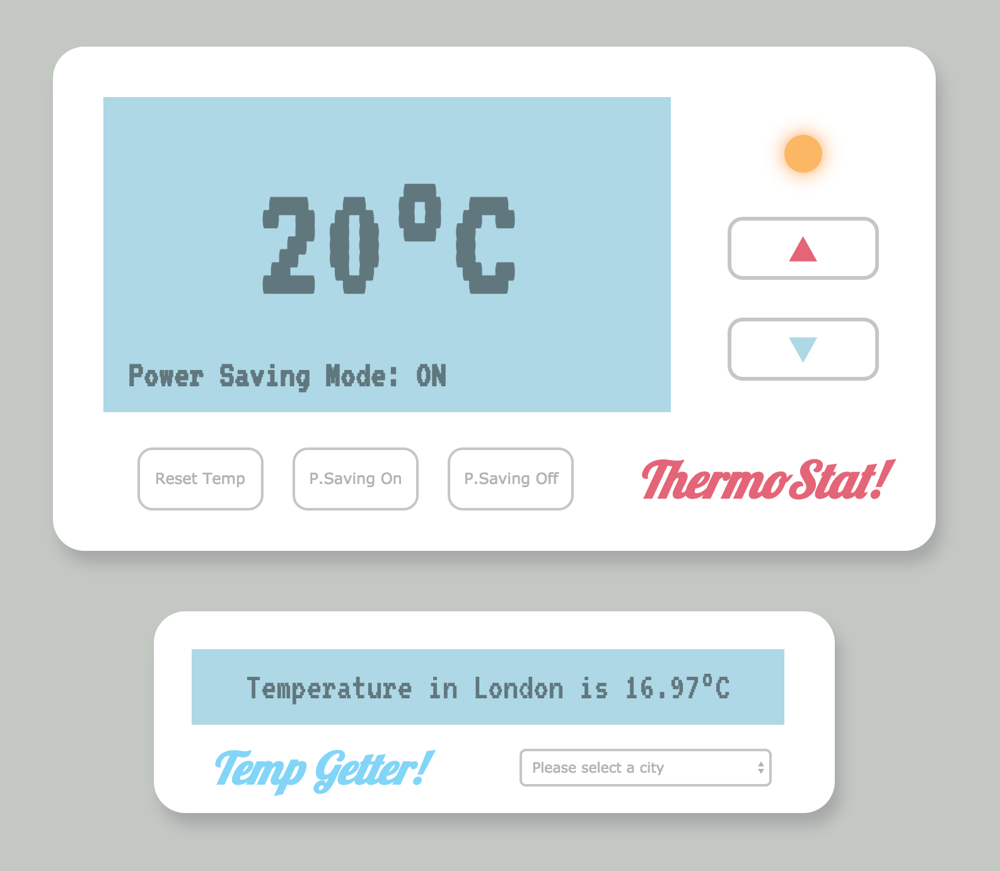

# Makers Academy Week Five - Thermostat
> 9-13 July 2018

Fifth week bootcamp project, building a Thermometer web-app in Javascript. The goal was to build a thermometer that increases/decreases temperature responding to user input, with different conditions according to whether 'power saving mode' is turned on. Connects with OpenWeatherMap API to retrieve and display city weather information.

## Completion

* Steps 5/6 complete.
* All tests passing.

## Learning Outcomes

Really enjoyed learning Javascript this week and applying it to the Thermostat project. Followed a step-by-step TDD process which helped to ensure that features were implemented correctly. It was fun using jQuery to dynamically change page elements, and interacting with external APIs was less painful than I expected. This week's project has helped me develop a process for learning a new language, and I'm keen to develop my understanding of Javascript.

## Technical

Javascript & jQuery with Jasmine for testing.

## Implementation

Download repo and open index.html in Chrome or Safari (Firefox currently has some issues displaying margins correctly).

## Further Improvements

* Integrate with Ruby and Sinatra to implement saving state.
* Alert message when temperature reaches upper/lower limit.
* Correct margin issues when displaying on Firefox.
