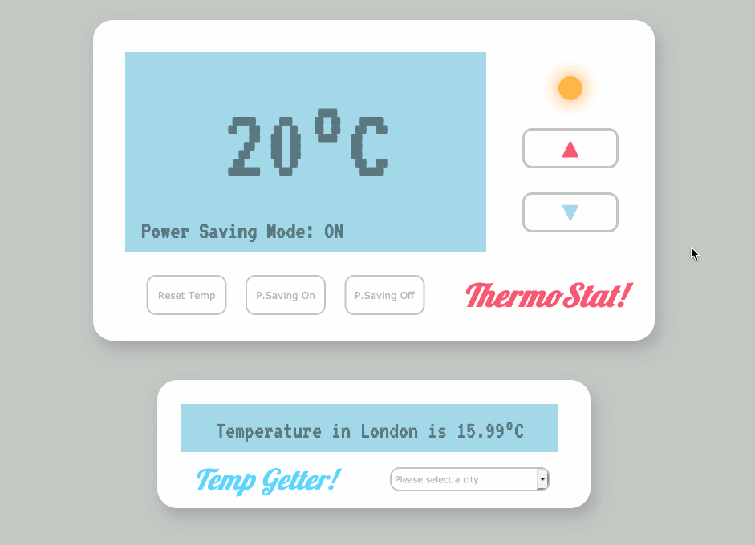

# Thermostat!

A simple thermometer web-app in Javascript that increases/decreases temperature in response to user input, with different conditions according to whether 'power saving mode' is turned on. Connects with the OpenWeatherMap API to retrieve and display city weather information.

## Technical

Javascript & jQuery with Jasmine for testing.

## Implementation

[Try out Thermostat! on Heroku](https://archmagos-thermostat.herokuapp.com/). Alternatively, clone this repo and open index.html in your browser.
